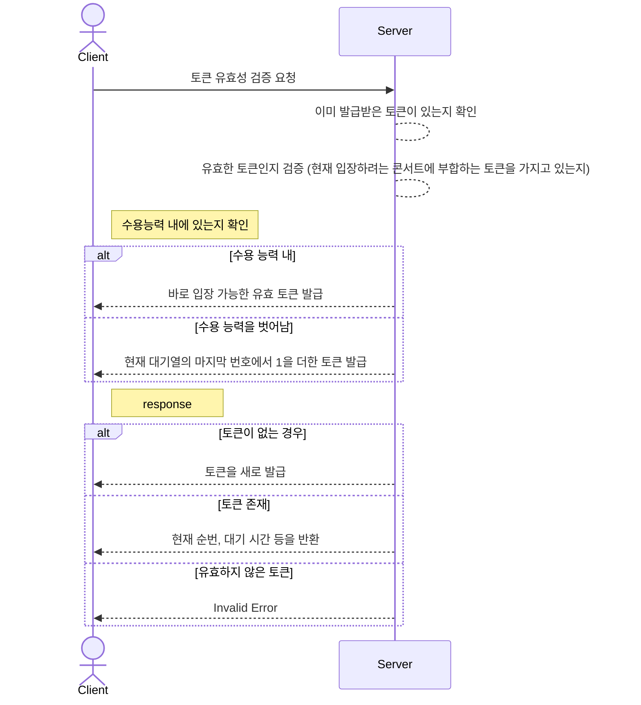
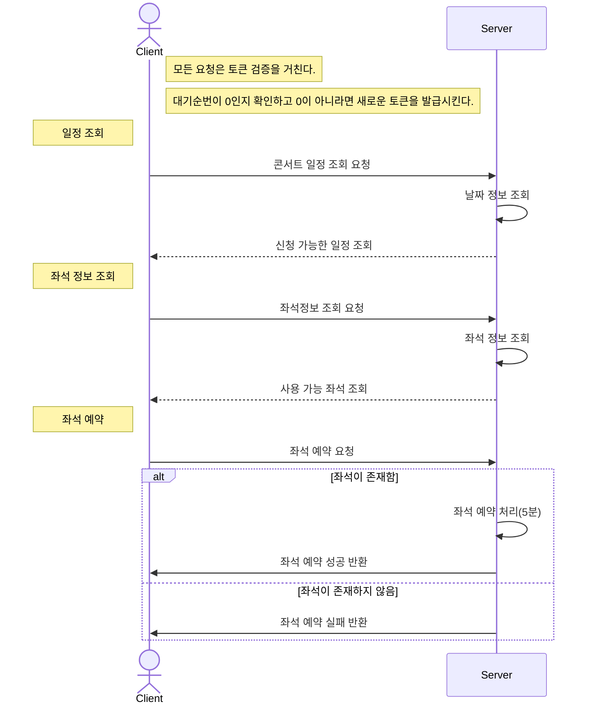
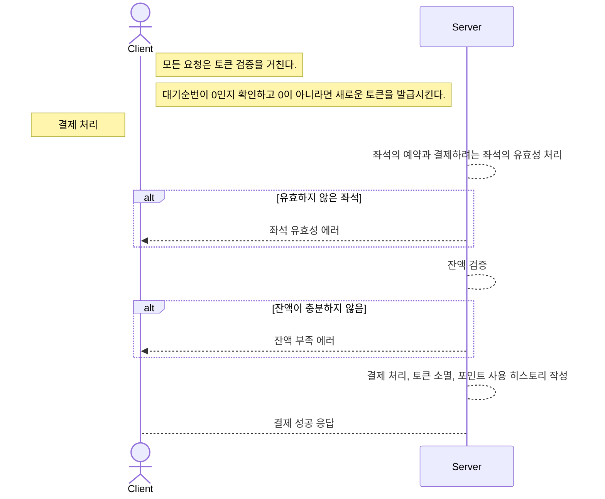

### api docs

[swagger-docs](https://app.swaggerhub.com/apis-docs/rnjsdud980/reserve-concert/0.0.1)

### 요구사항 분석
1. 토큰발급
- 토큰에는 콘서트 정보, 대기 순번을 확인할 수 있는 값을 넣어야 한다.
- 요청 들어온 콘서트 정보, 대기 순번이 db에 있는 값과 다르다면 새로운 토큰을 생성한다.
- db에 토큰이 없다면 새로운 토큰을 발급한다.
2. 콘서트 예약
- 일정 조회, 좌석 선택이 선행되어야 한다.
- 한 자리에 여러명이 예약이 가능하지 않도록 lcok을 활용해야한다.
- 좌석이 예약되고나서 5분 뒤에는 해당 좌석이 결제되지 않았다면 빈 좌석으로 처리한다.
3. 결제처리
- 예약한 좌석을 결제하고, 토큰을 초기화 해야한다.
- 요청 받은 좌석의 유효성 검사를 진행해야한다.

### 토큰 발급

### 콘서트 예약

### 결제 처리

### ERD

### 마일스톤
[notion](https://www.notion.so/0e137816d2544a87914244118e7804e1?pvs=4)
