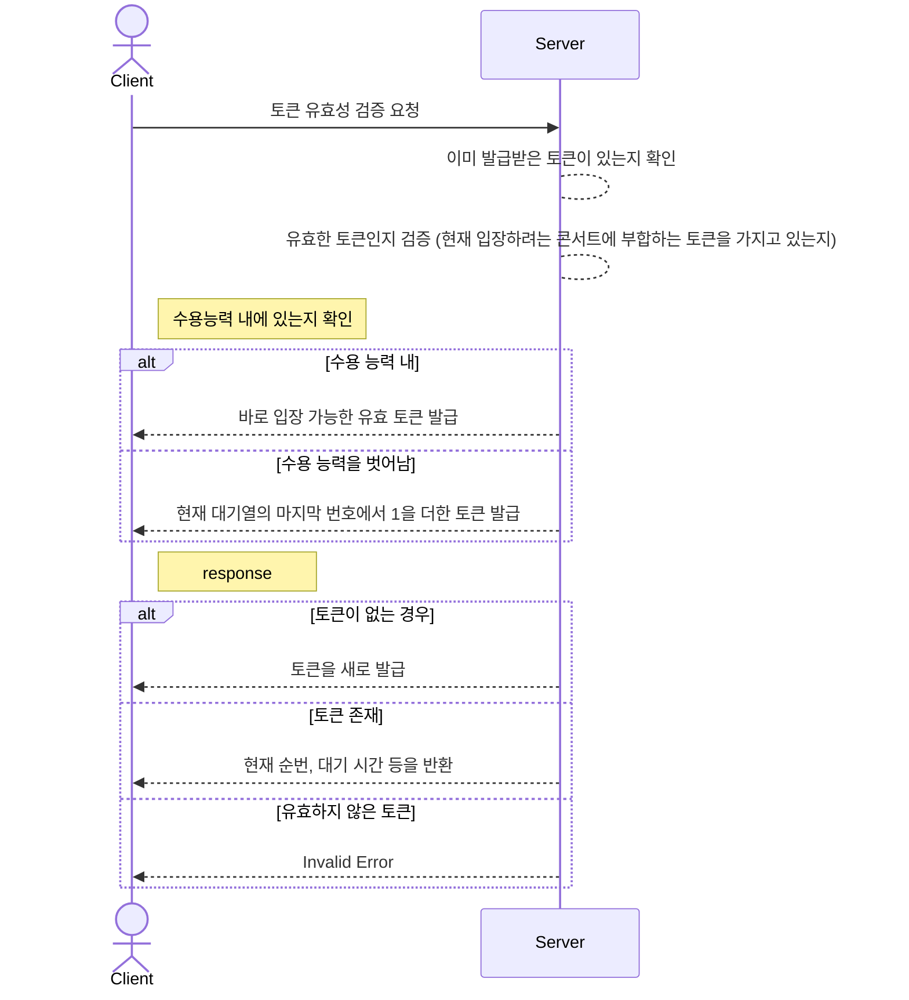
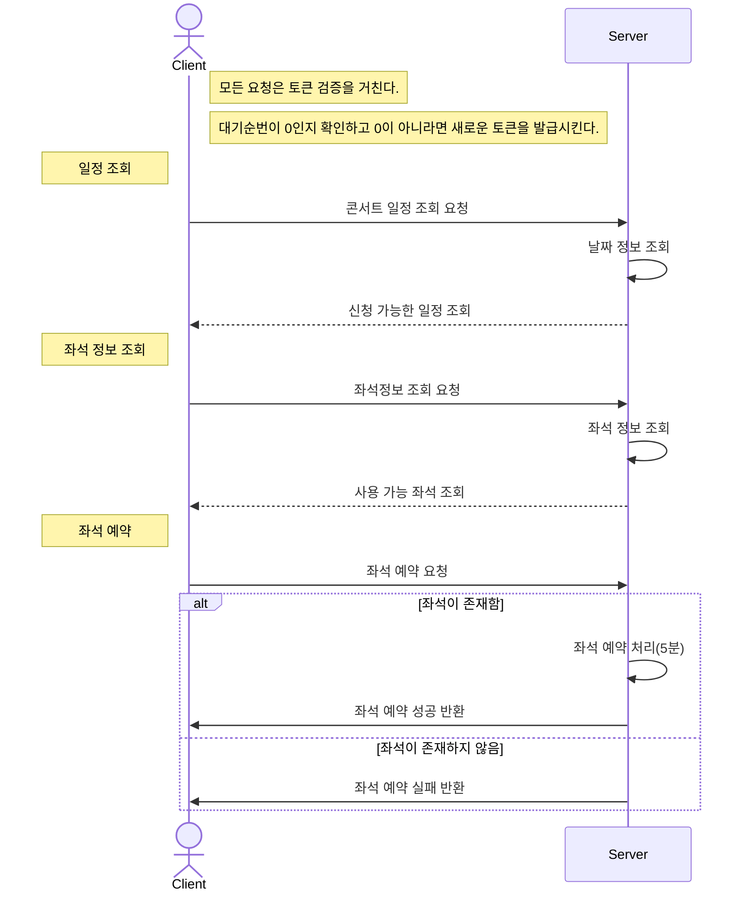
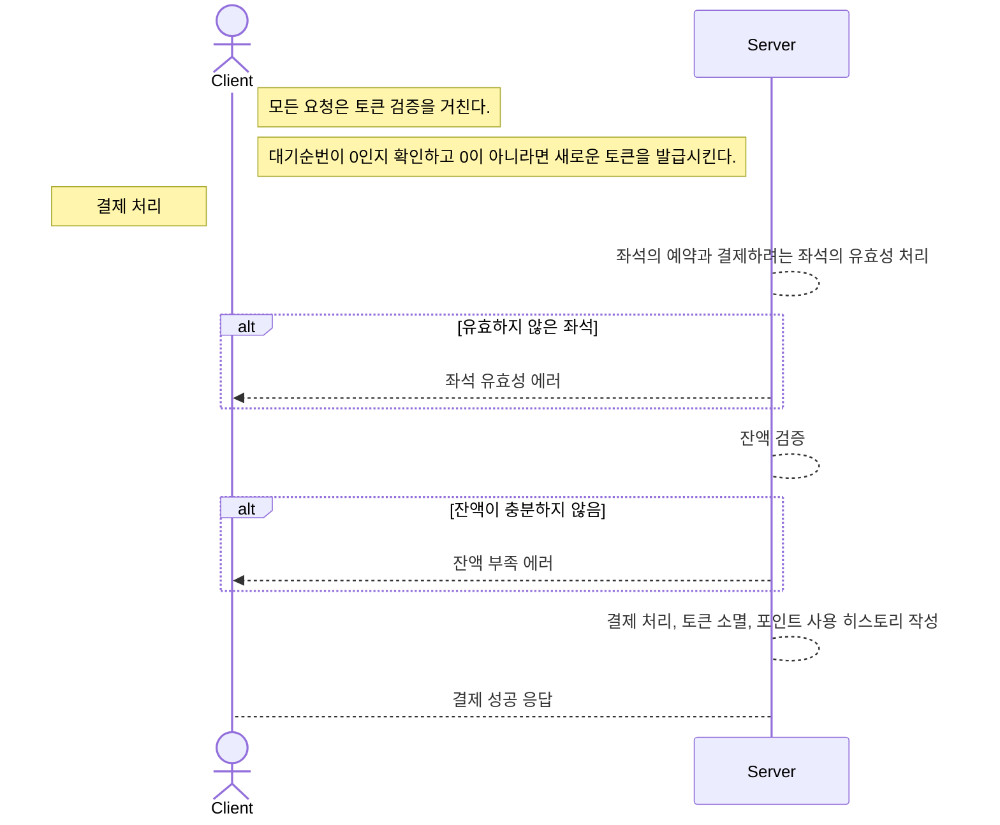

## 브랜치 전략
### main
- 실제 유저들에게 배포되어 있는 환경.
- main을 업데이트 하기 전에 반드시 staging에서 QA팀과 테스트를 거쳐야한다.
- main 브랜치는 push를 막고 반드시 PR로만 merge를 진행한다.
### staging
- 실제 환경과 같은 환경으로 구축해 테스트 할 수 있도록 구축
- staging에서 브랜치를 따서 dev에 merge를 하고, 해당 기능을 staging에 다시 merge한다.
- 절대 dev를 staging에 merge하지 않는다.
### dev
- 개발 중인 기능을 테스트하는 브랜치
- 현재 ci환경과 cd환경 github actions 작성 완료

### api docs

[swagger-docs](https://app.swaggerhub.com/apis-docs/rnjsdud980/reserve-concert/0.0.1)

### 요구사항 분석

1. 토큰발급

- 토큰에는 콘서트 정보, 대기 순번을 확인할 수 있는 값을 넣어야 한다.
- 요청 들어온 콘서트 정보, 대기 순번이 db에 있는 값과 다르다면 새로운 토큰을 생성한다.
- db에 토큰이 없다면 새로운 토큰을 발급한다.

2. 콘서트 예약

- 일정 조회, 좌석 선택이 선행되어야 한다.
- 한 자리에 여러명이 예약이 가능하지 않도록 lcok을 활용해야한다.
- 좌석이 예약되고나서 5분 뒤에는 해당 좌석이 결제되지 않았다면 빈 좌석으로 처리한다.

3. 결제처리

- 예약한 좌석을 결제하고, 토큰을 초기화 해야한다.
- 요청 받은 좌석의 유효성 검사를 진행해야한다.

### 토큰 발급

### 콘서트 예약

### 결제 처리

### ERD

- 하나의 콘서트는 여러개의 날짜를 가짐.
- 각 날짜의 콘서트는 여러 유저를 가질 수 있으며, Concert의 maxSeats만큼 seat를 가질 수 있음.
- 유저의 토큰에는 콘서트의 정보, 토큰의 만료 시간, 대기 순번 등의 정보를 암호화 하여 저장함.
- payStatus를 이용해 '예약'과 '결제' 상태를 나누어 좌석의 상태를 관리함.
  - '예약' 상태 이면서 데이터가 생성된지 5분이 지났다면 해당 row를 '좌석 예약 가능'으로 처리하고 다른 유저가 예약할 때 삭제

### 마일스톤

[notion](https://www.notion.so/0e137816d2544a87914244118e7804e1?pvs=4)
